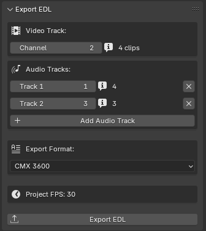
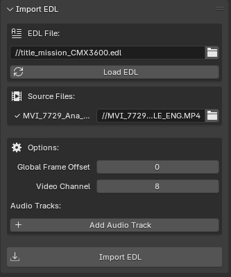

# Blender EDL Exporter

Export/Import Blender VSE timelines to EDL format for use in other video editors. Partialy vibe coded and heavily borrowed from:

https://blender-addons.org/import-edl/
https://blender-addons.org/export-edl/

A lot of import features remain untested with edge cases. This mainly a personnal use script for very basic export. There is a plan for supporting common xml formats as well (see FORMATS).

## Features

- Exports video + audio tracks
- 4 formats: CMX 3600, OpenShot, GVG, CMX 340
- Markers, gaps, dissolves, metadata
- Image sequence support

## Usage

### For export

1. Open VSE sidebar (N key) → EDL tab
2. Set video channel
3. Add audio tracks
4. Select format (CMX 3600 recommended)
5. Click "Export EDL"

### For import

1. Open VSE sidebar (N key) → EDL tab
2. Set EDL path
3. Set file paths
4. Select desired channel for import and frames offset.
5. Click "Import EDL"

**Formats:**
- **CMX 3600**: Premiere, Resolve, Media Composer
- **OpenShot**: OpenShot, Kdenlive
- **GVG**: Grass Valley
- **CMX 340**: Legacy (2 audio max)

## Requirements

- Blender 4.0+
- Supported: MOVIE, SOUND, IMAGE strips
- Transitions: CROSS, GAMMA_CROSS

## Issues to fix

- Problem with channel alignment at import
- Untested in and out loops for non CMX 3600
- Untested with industry editors
- Workflow and usefulness of multi audio track is uncertain, maybe keeping it at one channel would be best. 

With that being fixed/tested, this can be a decent basic edl import/export tool. Next refacto after these would be modularity and unification of the two addons in a more manageable file structure. Next feature should be xml standards inclusion.

